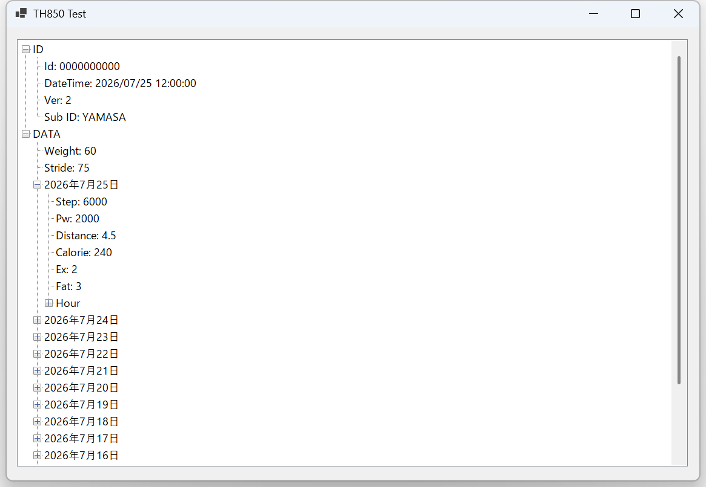

# Th850Library

山佐時計計器株式会社製
[USBポケット万歩計 TH-850](https://www.yamasa-tokei.co.jp/seihin/support_service/th_850.html)
から情報を読み出す .NET ライブラリです。

独自に解析したUSBコマンドから作成したライブラリであり、
内容については山佐時計計器株式会社とは全く関係ありません。

また、本ライブラリを使用することで、万歩計に機能に損傷が発生しても、
一切補償はない旨ご了承の上利用ください。

## 構成

| プロジェクト | 内容 | ターゲット |
|:--|:--|:--|
| `Th850Library` | 本体のライブラリ | `netstandard2.0` |
| `Th850Test` | 読み出し結果を TreeView に表示する動作確認用アプリ | `net10.0-windows` |

依存は NuGet の [hidlibrary](https://www.nuget.org/packages/hidlibrary) のみです。

## ビルド

.NET SDK（10.0 以降）と Windows が必要です。

```
dotnet build -c Release
```

動作確認用アプリを実行する場合:

```
dotnet run --project Th850Test
```

## 使い方

`Th850Devices.Enumerate()` で接続されている TH-850 を列挙し、`ReadId()` / `ReadData()` で読み出します。
`Th850Device` は `IDisposable` です。**必ず破棄してください**（HID ハンドルと受信バッファを保持します）。

```csharp
using Th850Library;

foreach (var device in Th850Devices.Enumerate())
{
    using (device)
    {
        var id = device.ReadId();
        if (id == null || !id.IsValid) continue;

        Console.WriteLine($"デバイスID: {id.DeviceId}");
        Console.WriteLine($"本体時刻  : {id.DateTime}");
        Console.WriteLine($"FW        : {id.FirmwareVersion}");

        var data = device.ReadData();
        if (data == null || !data.IsValid) continue;

        Console.WriteLine($"体重      : {data.Weight}");
        Console.WriteLine($"歩幅      : {data.Stride} cm");

        // 当日から14日前までの15日分
        foreach (var day in data.DailyWorkouts)
        {
            Console.WriteLine($"{day.Date:yyyy/MM/dd}  {day.Step} 歩  {day.Distance} km  {day.Calorie} kcal");

            // 0時から23時までの1時間ごとの内訳
            foreach (var hour in day.HourlyWorkouts)
                Console.WriteLine($"    {hour.Hour:00}時  {hour.Step} 歩");
        }
    }
}
```

### 読み出せる項目

| クラス | プロパティ | 内容 |
|:--|:--|:--|
| `Th850Id` | `DeviceId` / `DateTime` / `FirmwareVersion` / `SubId` | 個体ID・本体時刻・ファームウェア版数 |
| `Th850Data` | `DeviceId` / `DateTime` / `Weight` / `Stride` | 本体に設定された体重・歩幅 |
| `Th850Data.DailyWorkouts` | `Date` / `Step` / `Pw` / `Distance` / `Calorie` / `Ex` / `Fat` | 1日ごとの集計（当日〜14日前の15日分） |
| `DailyWorkout.HourlyWorkouts` | `Hour` / `Step` / `Pw` / `Ex` | 1時間ごとの内訳（0〜23時） |

読み出しに失敗すると `ReadId()` / `ReadData()` は `null` を返します。
応答が得られてもチェックサムや書式が不正な場合は `IsValid` が `false` になるため、両方を確認してください。

## 動作確認用アプリ

`Th850Test` は接続を 500 ミリ秒間隔で監視し、TH-850 が挿されると読み出して表示します。



※ 画面に表示されている値はすべてサンプルであり、実機のデータではありません。

## ライセンス

[MIT License](LICENSE)
